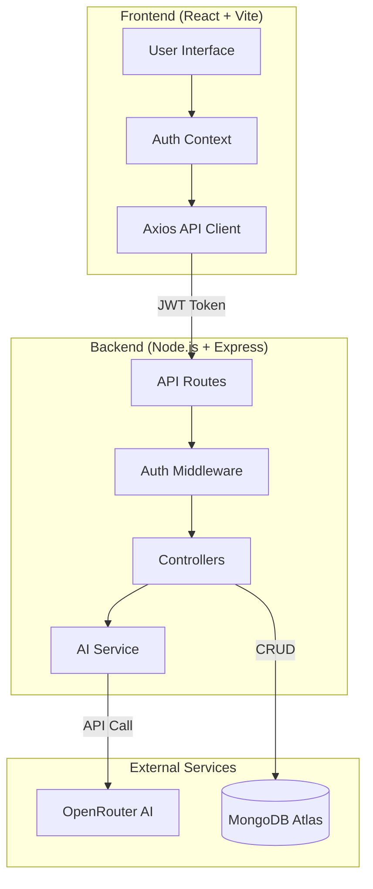
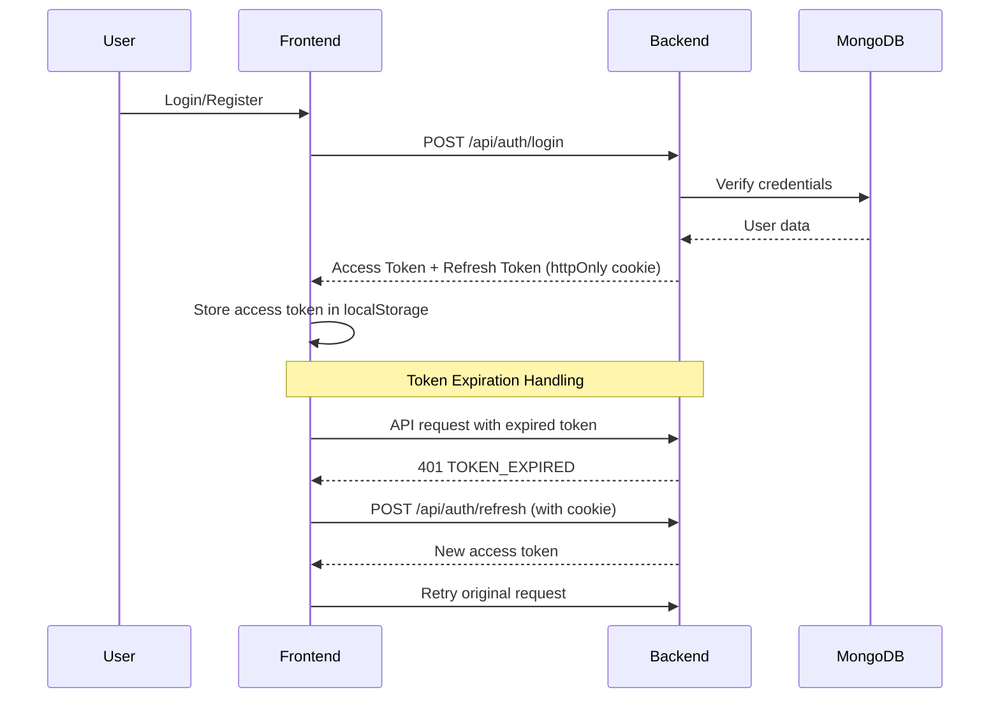

# 🎯 AI Interview Simulator

> **An intelligent interview coaching platform powered by AI that provides real-time feedback, skill assessment, and personalized growth recommendations.**

[](https://694a1189e7e868433f22abf2--comforting-seahorse-44ee79.netlify.app)
[](https://ai-interview-simulator-q03y.onrender.com/health)

---

## 🚀 The Problem

Technical interviews are stressful and unpredictable. Candidates often:
- ❌ Don't know their weak areas until it's too late
- ❌ Lack personalized feedback on their answers
- ❌ Can't track improvement over time
- ❌ Don't have access to realistic practice environments

## 💡 The Solution

An AI-powered interview simulator that:
- ✅ Conducts realistic technical interviews across multiple roles (Frontend, Backend, ML, SDE)
- ✅ Provides instant, detailed feedback on every answer
- ✅ Identifies skill gaps with radar chart visualization
- ✅ Generates personalized growth plans
- ✅ Tracks progress with comprehensive PDF reports

---

## 🎥 Demo

**Live Application:** [https://694a1189e7e868433f22abf2--comforting-seahorse-44ee79.netlify.app](https://694a1189e7e868433f22abf2--comforting-seahorse-44ee79.netlify.app)

**Backend API:** [https://ai-interview-simulator-q03y.onrender.com](https://ai-interview-simulator-q03y.onrender.com)

### Key Features in Action:
1. **Dynamic Interview Sessions** - Choose role, difficulty, and interview length
2. **Real-time AI Feedback** - Get scored on correctness, clarity, and confidence
3. **Skill Assessment** - Visual radar chart showing strengths and gaps
4. **Growth Recommendations** - Personalized action items (Quick Fix, Build Strength, Interview Ready)
5. **PDF Reports** - Downloadable interview summaries

---

## 🏗️ Architecture



### Tech Stack

**Frontend:**
- React 18 + Vite
- TailwindCSS for styling
- Recharts for data visualization
- Axios for API calls
- React Router for navigation

**Backend:**
- Node.js + Express
- MongoDB + Mongoose
- JWT (Access + Refresh tokens)
- OpenRouter AI (GPT-4o-mini)
- PDFKit for report generation

**Deployment:**
- Frontend: Netlify
- Backend: Render
- Database: MongoDB Atlas

---

## 🧠 How AI is Used

### 1. **Intelligent Question Generation**
- AI generates contextual follow-up questions based on previous answers
- Adapts difficulty based on role (Frontend, Backend, ML, SDE) and level (Junior, Mid, Senior)
- Maintains conversation flow for realistic interview experience

### 2. **Multi-Dimensional Scoring**
Every answer is evaluated on:
- **Correctness** (0-10): Technical accuracy
- **Clarity** (0-10): Communication effectiveness
- **Confidence** (0-10): Presentation quality

### 3. **Skill Detection & Assessment**
- AI identifies skills demonstrated in each answer
- Tracks skill proficiency over time with weighted updates
- Maps skills to role-specific taxonomy (e.g., React, Node.js, DSA)

### 4. **Personalized Recommendations**
AI generates actionable growth plans:
- **Quick Fix (1-2 days)**: Immediate improvements
- **Build Strength (1-2 weeks)**: Skill development
- **Interview Ready (1 month)**: Long-term mastery

---

## 🔐 Authentication Flow



### Security Features:
- **JWT Access Tokens** (15 min expiry) - Stored in localStorage
- **Refresh Tokens** (7 days) - httpOnly cookies for XSS protection
- **Automatic Token Refresh** - Seamless user experience
- **CORS Protection** - Whitelist-based origin validation
- **Rate Limiting** - Prevent abuse
- **Input Sanitization** - XSS and NoSQL injection protection

---

## 📊 Skill Assessment Logic

### Data Flow:
```
Answer → AI Analysis → Skill Detection → Score Calculation → Radar Chart Update
```

### Scoring Algorithm:
1. **Initial Score**: AI assigns 0-100 for each detected skill
2. **Weighted Update**: `newScore = (oldScore × 0.7) + (aiScore × 0.3)`
3. **Taxonomy Mapping**: Skills mapped to role-specific categories
4. **Gap Identification**: Skills < 60 flagged as priority gaps
5. **Recommendation Generation**: AI creates targeted improvement plans

### Visualization:
- **Radar Chart**: 6-axis skill profile (role-specific)
- **Progress Bars**: Individual skill tracking
- **Gap Analysis**: Top 3 weaknesses highlighted

---

## 🧪 Edge Cases Handled

### 1. **Token Expiration**
- ✅ Automatic refresh on 401 errors
- ✅ Retry failed requests with new token
- ✅ Graceful logout on refresh failure

### 2. **Interview Length Limits**
- ✅ Quick (5 questions), Full (10), Deep (15), Unlimited
- ✅ Enforced server-side with question counting
- ✅ Completion screen with summary scores

### 3. **Session State Management**
- ✅ Resume interrupted sessions
- ✅ Prevent duplicate question generation
- ✅ Handle completed sessions gracefully

### 4. **Network Failures**
- ✅ Retry logic for transient errors
- ✅ User-friendly error messages
- ✅ Loading states for async operations

### 5. **Data Consistency**
- ✅ Single source of truth for question counts
- ✅ Atomic database operations
- ✅ Proper error rollback

---

## 🎨 Key Features

### For Users:
- 🎯 **4 Interview Modes**: Technical, Behavioral, System Design, Mixed
- 📏 **Flexible Length**: Quick (5), Full (10), Deep (15), Unlimited
- 📊 **Real-time Feedback**: Instant scoring on every answer
- 📈 **Progress Tracking**: Visual skill radar charts
- 📄 **PDF Reports**: Downloadable interview summaries
- 🔄 **Session History**: Review past interviews

### For Developers:
- 🔐 **Secure Auth**: JWT with refresh token rotation
- 🚀 **Scalable Architecture**: Modular service layer
- 📦 **Clean Code**: ESLint + Prettier configured
- 🧪 **Error Handling**: Comprehensive try-catch with logging
- 🌐 **CORS**: Production-ready cross-origin setup
- 📝 **API Documentation**: RESTful endpoints

---

## 🚀 Getting Started

### Prerequisites
- Node.js 18+
- MongoDB Atlas account
- OpenRouter API key

### Installation

1. **Clone the repository**
```bash
git clone https://github.com/prudhivisaikiran/ai-interview-simulator.git
cd ai-interview-simulator
```

2. **Backend Setup**
```bash
cd backend
npm install
cp .env.example .env
# Edit .env with your credentials
npm run dev
```

3. **Frontend Setup**
```bash
cd frontend
npm install
cp .env.example .env
# Edit .env with backend URL
npm run dev
```

### Environment Variables

**Backend (.env):**
```env
PORT=5000
MONGO_URI=your_mongodb_connection_string
JWT_ACCESS_SECRET=your_access_secret
JWT_ACCESS_EXPIRES_IN=15m
JWT_REFRESH_SECRET=your_refresh_secret
JWT_REFRESH_EXPIRES_IN=7d
OPENAI_API_KEY=your_openrouter_key
OPENAI_BASE_URL=https://openrouter.ai/api/v1
AI_MODEL=openai/gpt-4o-mini
NODE_ENV=development
```

**Frontend (.env):**
```env
VITE_API_URL=http://localhost:5000/api
```

---

## 📁 Project Structure

```
ai-interview-simulator/
├── backend/
│   ├── src/
│   │   ├── controllers/      # Request handlers
│   │   ├── models/           # MongoDB schemas
│   │   ├── routes/           # API routes
│   │   ├── services/         # Business logic (AI, Assessment, PDF)
│   │   ├── middlewares/      # Auth, error handling
│   │   └── utils/            # Helper functions
│   └── package.json
├── frontend/
│   ├── src/
│   │   ├── components/       # Reusable UI components
│   │   ├── pages/            # Route pages
│   │   ├── services/         # API client, auth
│   │   ├── context/          # React context (Auth)
│   │   └── main.jsx
│   └── package.json
└── README.md
```

---

## 🔗 API Endpoints

### Authentication
- `POST /api/auth/register` - Create account
- `POST /api/auth/login` - Login
- `POST /api/auth/logout` - Logout
- `POST /api/auth/refresh` - Refresh access token
- `GET /api/auth/me` - Get current user

### Interview Sessions
- `POST /api/sessions` - Create new session
- `GET /api/sessions` - Get all sessions
- `GET /api/sessions/:id` - Get session details
- `POST /api/sessions/:id/start` - Start interview
- `POST /api/sessions/:id/answer` - Submit answer
- `GET /api/sessions/:id/assessment` - Get skill assessment
- `GET /api/sessions/:id/report` - Download PDF report

---

## 🎯 Future Enhancements

- [ ] Voice-based interviews with speech recognition
- [ ] Video recording for body language analysis
- [ ] Collaborative mock interviews (peer-to-peer)
- [ ] Company-specific interview prep (FAANG, startups)
- [ ] Mobile app (React Native)
- [ ] Interview scheduling with calendar integration
- [ ] Leaderboards and community challenges

---

## 👨‍💻 Author

**Sai Kiran Prudhvi**  
*Full-Stack & AI Engineer*

> Building intelligent systems that solve real-world problems.

- GitHub: [@prudhivisaikiran](https://github.com/prudhivisaikiran)

---

## 📄 License

This project is licensed under the MIT License - see the [LICENSE](LICENSE) file for details.

---

## 🙏 Acknowledgments

- OpenRouter for AI API access
- MongoDB Atlas for database hosting
- Netlify & Render for deployment
- React & Node.js communities

---

**⭐ If this project helped you, please give it a star!**
